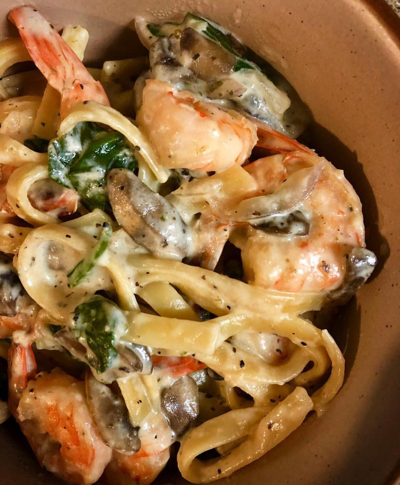

I always opt for tasty, yet easy things to make. Call it a lazy wife’s guide to cooking if you will. And this is one of the first meals I made and I scored big. Best of all, this only takes one pot, so less dishes to clean!

## Ingredients

#### for 4 servings

* 1lb shrimp - rinsed, peeled and deveined
* 4 cups spinach (I prefer baby spinach)
* 1/2 cup sliced mushrooms
* 8 oz fettuccine pasta
* 1 tbsp butter
* 1 tbsp olive oil
* 1 tsp salt
* 1 tsp pepper
* 1 tsp salt
* 1⁄2 tsp italian seasoning
* 2 cloves garlic, minced
* 2 cup chicken broth
* 1 cup milk
* 1/2 cup heavy cream
* 1⁄4 cup grated parmesan
* Extra cheese to garnish

*Tip: Once you rinse the shrimp, make sure to pat them dry. Else it’ll be too watery and wouldn’t sauté properly due to the excess liquid in the pan.*

*You may also substitute 2 cups of almond milk instead of using milk and heavy cream.*

## Preparation

1. In a heated pot, melt the butter and olive oil. And the garlic and shrimp and season with salt and pepper.

2. Sauté the shrimp until pink, set aside. And sauté the mushrooms in the same pot and set aside that too.

3. To the same pot add the broth, milk and pasta.

4. Cook for 8 mins, stirring occasionally, so that the pasta does not stick.

5. To avoid the pasta from overcooking, add the spinach right before the pasta is al dente and stir till the spinach is wilted.

6. Then add salt, pepper, cheese, seasoning and mix until everything is coated properly.

7. Add the shrimp and mushrooms and give it a good stir.

8. Sprinkle some extra parmesan cheese on top and serve hot!
